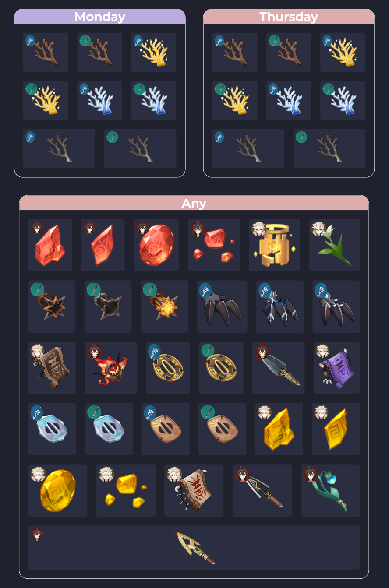

# Farming Impact

Farming Impact is a calendar generator built 
with React, Redux, and Node.

Farming Impact is [live on Netlify](https://farmingimpact.netlify.app).

Users can browse for characters or weapons they would like to level up 
and create a calendar that helps them keep track of what and when to farm. 

Calendars can be exported as png screenshots. 


<!--  -->


## Table Of Contents
- [Installation](https://github.com/kathyn138/farmingimpact#installation)
- [Testing](https://github.com/kathyn138/farmingimpact#testing)
- [Technologies](https://github.com/kathyn138/farmingimpact#technologies)
- [Component Hierarchy](https://github.com/kathyn138/farmingimpact#component-hierarchy)
- [Future Implementations](https://github.com/kathyn138/farmingimpact/#future-implementations)

## Installation 
Use npm to install dependencies and start servers for the frontend and backend.

Backend Setup:
```
cd backend
npm install
npm start
```

Frontend Setup:
```
cd frontend
npm install 
npm start
```

## Testing
Front end unit tests are written with The React Testing Library. Run the tests with the following commands:
```
cd frontend
npm test
```

Back end unit tests are written with Jest. Run the tests with the following commands:
```
cd backend
jest
```

## Technologies
- React
- Redux
- Node
- HTML/CSS
- Bootstrap

## Component Hierarchy 
```
App
├── NavBar
└─┬ Routes
  ├── Home
  ├──┬ EntityList 
  │  └── Entity   
  ├──┬ CalendarContainer
  │  └─┬ CalendarDay
  │    └── CalendarItem
  └─┬ CartContainer
    └── CartItem
```

## Future Implementations
- Search for character/weapon
- Delete items from calendar 